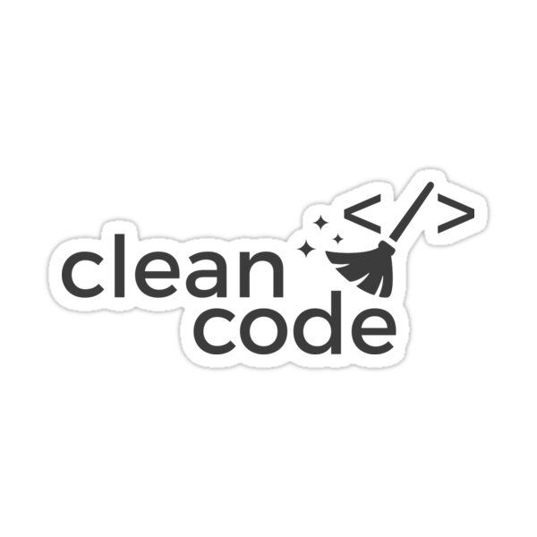

  

  <h3 align="center">Clean Code</h3>

  

    Clean code practcing and guides.
  

# what is clean code

code which is readable and easy to understand

# clean code vs clean architecture

- clean code

  - is about the code and how you write the code.
  - focus on single problem.

- clean architecture
  - is about project structures, patterns and where you write the code.
  - focus on whole project.

# clean code main points

- naming (variables,functions,classes)
- structure, formatting, comments
- conditions and nesting
- error handling
- functions parameters and function block length
- classes and large classes

 
 
 
 
 

# 1. naming

- names should be meaningful, meaningful names make code self explanatory and don't required comments or going through details.
- be consistent
- choose distinctive names

## name casing

> try to follow language convention:

- snake_case in variables and functions like python
- camelCase in variables and functions like javascript and java
- PascalCase in classes like python, java , javascript

## varibale naming

- use nouns or short adjective phrase [userData,isValid]
- describe the value if number [age], string [name], object [user,database]
- true/false question if boolean [isActive,isValid]
- you may add some details without redundancy [firstName,sqlDatabase,activeUser,isValidInput]

## functions naming

- use verbs or short adjective phrase [storeDate(),inputIsValid()]
- describe the operation if perform an operation [response.send(),getUser()]
- true/false question if compute a boolean [isActive(),isValid()]
- you may add some details without redundancy [getUserById(),emailIsValid()]

## class naming

- use nouns or short noun [phraseUser,RequestBody]
- describe the object [User,Customer,Database]
